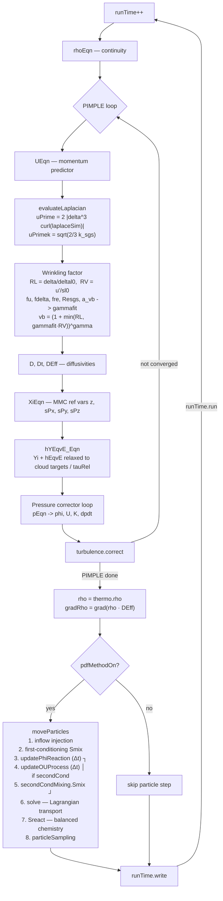

# SPFoam

`SPFoam` is a compressible **LES / Filtered Density Function (FDF)** solver for turbulent reacting flows, part of the `mmcFoam` family. It couples an Eulerian LES finite-volume solver with a Lagrangian **Pope-particle cloud** that carries the joint composition PDF, and uses **Multiple Mapping Conditioning (MMC)** reference variables to drive particle mixing.

Source: `applications/solvers/mmc/SPFoam/`

## What it solves

The solver advances, every PIMPLE outer iteration:

- the compressible momentum equation (`UEqn.H`)
- a subgrid wrinkling factor `vb` built from a Charlette-style fit (`SPFoam.C`)
- the MMC reference variables `Xi = {z, sPx, sPy, sPz}` (`XiEqn.H`, `mmcVariablesDefinitions`)
- equivalent species mass fractions and enthalpy `Yi`, `hEqvE` (`hYEqvE_Eqn.H`)
- the pressure equation in a non-orthogonal correction loop (`pEqn.H`)
- the turbulence model

After PIMPLE closes, the Lagrangian Pope cloud is advanced and its particle composition is used to build the relaxation targets `YEqvETarget`, `TEqvETarget`, `hEqvETarget` for the next step.

## Components

| Layer | Role | Key files |
|---|---|---|
| Eulerian LES | PIMPLE-based compressible NS (U, p, ρ, hEqvE, Yi) | `UEqn.H`, `pEqn.H`, `hYEqvE_Eqn.H` |
| MMC reference vars | Transports `z, sPx, sPy, sPz` as conditioning variables | `XiEqn.H`, `mmcVariablesDefinitions` |
| Pope particle cloud | Lagrangian PDF particles; mixing, reaction, optional second-conditioning (OU process) | `createParticles.H`, `moveParticles.H` |
| Subgrid wrinkling | `vb` from RV, RL, fu, fdelta, fre via `gammafit` | `SPFoam.C` (PIMPLE body) |
| Dual-mesh Laplacian | Restrict U to coarse `evalLaplace` mesh, evaluate ∇²U, project back; gives `uPrime` | `createEvalLaplaceMesh.H`, `evaluateLaplacian.H` |

## Time-step workflow



<details>
<summary>Mermaid source</summary>



</details>

## Two-way coupling

1. The cloud builds **target fields** `YEqvETarget`, `TEqvETarget`, `hEqvETarget` from the conditioned particle composition (`EqvETargetValues`).
2. Eulerian `Yi` and `hEqvE` equations include a relaxation source toward those targets:
   $$\rho \, \frac{Y_i^{\text{target}} - Y_i}{\tau_{\text{rel}}} \cdot \text{Indicator}$$
   with `tauRel` blending from `tauRelaxStart` toward `tauRelaxTarget` (linear in time-step count, see `XiEqn.H`).
3. The updated Eulerian `U`, `rho`, `DEff`, `gradRho` are passed back to the cloud through the constructor references and used to advance the particles in the next step.

`EqvETargetValues` is supplied by the selected `thermoPhysicalCouplingModel`:

- **`ParticleInCell`** — local: averages particles within each super-cell; `Indicator=0` (source off) wherever a super-cell holds no contributing particle.
- **`KernelEstimation`** — non-local: for each cell it kernel-weights the `nNearest` particles in (x, y, z, conditioning-variable) space, so cells without a local particle still receive a target. This suits the second-conditioning **flagged subset** (sparse particles): the subset filter keeps every flagged particle (no down-sampling), so coverage (`Indicator=1`) stays high; `Indicator=0` only outside `[fLow, fHigh]` or where the kernel has no support. Set `fLow/fHigh` to bracket the flagged subset's conditioning-variable band.
  - **Conditioning variable.** By default the kernel conditions on the resolved mixture fraction (`condVariable z`/`f`). Set `condVariable phiModified` to condition on the reaction-progress variable φ° instead. φ° is a particle-only quantity, so the model first projects the flagged particles' φ° onto the mesh (a super-cell weighted mean) and conditions on that field; cells whose super-cell holds no flagged particle keep a sentinel and stay uncoupled (coverage bounded by the flagged support).

## MMC reference variables

Defined in `mmcVariablesDefinitions`:

| Variable | Role |
|---|---|
| `z`   | passive `couplingVar` (mixture fraction–like conditioning variable) |
| `sPx`, `sPy`, `sPz` | `referenceVar` of type `sde` — stochastic shadow positions used for conditional mixing |

`XiEqn.H` solves a relaxation–convection–diffusion equation for each `Xi` toward its coupling target, with the same `tauRel` blending used for species/enthalpy.

## Subgrid wrinkling model

Per-cell variables computed in the PIMPLE loop (`SPFoam.C:117–142`):

| Symbol | Meaning |
|---|---|
| `LES_delta` | LES filter width (read from `delta` if present) |
| `dynsl0`, `dyndeltal0` | Laminar flame speed and thickness (initialised to fixed values, then per-cell) |
| `RL = LES_delta / dyndeltal0` | Length-scale ratio |
| `RV = uPrime / dynsl0` | Velocity-scale ratio |
| `fu, fdelta, fre, Resgs, a_vb` | Charlette efficiency components |
| `gammafit` | Combined efficiency function |
| `vb` | Wrinkling factor `vb = (1 + min(RL, gammafit·RV))^γ` |

Tuning constants in `SPFoam.C:78–92`: `Ck=1.5`, `b_vb=1.4`, `gamma=0.5`, `uPrimeCoeff=1.0`. The flame-speed/thickness pair `fixedsl0_` / `fixeddeltal0_` is currently set for **SC-Aachen** (`4.09e-1`, `3.62e-4`); DC-Aachen and SC/DC-Darmstadt presets are commented in-place and can be uncommented when switching cases.

## Dual-mesh Laplacian

`uPrime` requires `∇²U` on a scale coarser than the LES filter. The solver does this by:

1. Reading an `evalLaplace` region alongside the main mesh (`createEvalLaplaceMesh.H`).
2. Building a cell-to-cell map between fine LES cells and coarse Laplacian cells via `findCellFacePt`. The coarse mesh is expected to be roughly an 8-to-1 coarsening (`numCells/8` — assertion is commented but documents intent).
3. Density-weighted averaging `U` onto `Uint` on the coarse mesh, evaluating `coarseLap = fvc::laplacian(Uint)`, and broadcasting back to all fine cells inside each coarse cell (`evaluateLaplacian.H`).
4. Computing `uPrime = 2 |δ³ ∇×laplaceSim|`.

## Pope-particle cloud (`moveParticles.H`)

When `PDFMETHOD.pdfMethodOn = true`:

1. **Inflow injection** — `inflowBoundary().inflow()`
2. **First-conditioning mixing** — `mixing().Smix()` over all particles
3. *(optional, gated by `secondCondMixingEnabled()`)*
   1. `updatePhiReaction(Δt)` — apply chemical source W(φ) on **all** particles
   2. `updateOUProcess(Δt)` — advance Ornstein–Uhlenbeck process and recompute φ° on the flagged subset
   3. `secondCondMixing().Smix()` — second-conditioning mixing on the subset
4. **Solve** — `solve(td)`: Lagrangian transport (and chemistry if `balanceReactionLoad` is off)
5. **Balanced chemistry** — `reaction().Sreact()` and ISAT bookkeeping, if `balanceReactionLoad` is on
6. **Mass-fraction correction** and **particle statistics**

When `pdfMethodOn = false` the solver runs as pure LES: `tauRel` stays zero, the cloud step is skipped, and the relaxation source in `Yi` / `hEqvE` vanishes.

## Controls and inputs

| File | Purpose |
|---|---|
| `constant/transportProperties` | `SchmidtNumber`, `TurbulentSchmidtNumber` |
| `constant/thermophysicalProperties` | `psiReactionThermo` setup, `inertSpecie` |
| `constant/cloudProperties` | Pope-particle cloud configuration (mixing, coupling, OU, second-conditioning, reaction) |
| `constant/g` | Gravitational acceleration |
| `system/fvSolution` `PDFMETHOD` | `pdfMethodOn`, `iniReleaseOn`, `nSet` |
| `system/fvSchemes` | needs `div(phi,Xii)` and `div(phi,Yi_h)` schemes for the multivariate convection |
| Coarse mesh region | An `evalLaplace` region must exist alongside the main mesh |

## Building and running

```bash
# Build
cd applications/solvers/mmc/SPFoam
wmake

# Or build all mmcFoam apps
./Allwmake
```

The executable lands in `$FOAM_USER_APPBIN/SPFoam`. Run from the case directory like any OpenFOAM solver:

```bash
SPFoam
# parallel:
mpirun -np N SPFoam -parallel
```

## Known gotchas

- **Hardcoded `solverDir`** in `createFields.H` (the path used to read `mmcVariablesDefinitions`) points to an absolute Gadi path. Edit it before building on a new machine, otherwise the run aborts on dictionary read.
- **Flame parameters** `fixedsl0_` / `fixeddeltal0_` are set in source for SC-Aachen. Switching case requires editing `SPFoam.C` and rebuilding.
- The `evalLaplace` mesh must geometrically contain every LES cell centre, otherwise `findCellFacePt` fails silently into cell 0.
- Without `pdfMethodOn`, the MMC coupling sources drop out — useful as a sanity check that the LES side runs cleanly.

## See also

- [`mmcDNSFoam`](mmcDNSFoam.md) — DNS variant with stochastic particles as passive tracers
- [Code overview](codeOverview.md)
- [Particle management](mmc/particleManagement.md)
